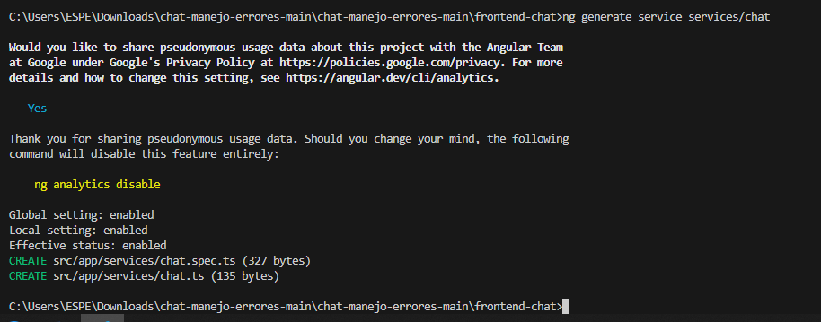
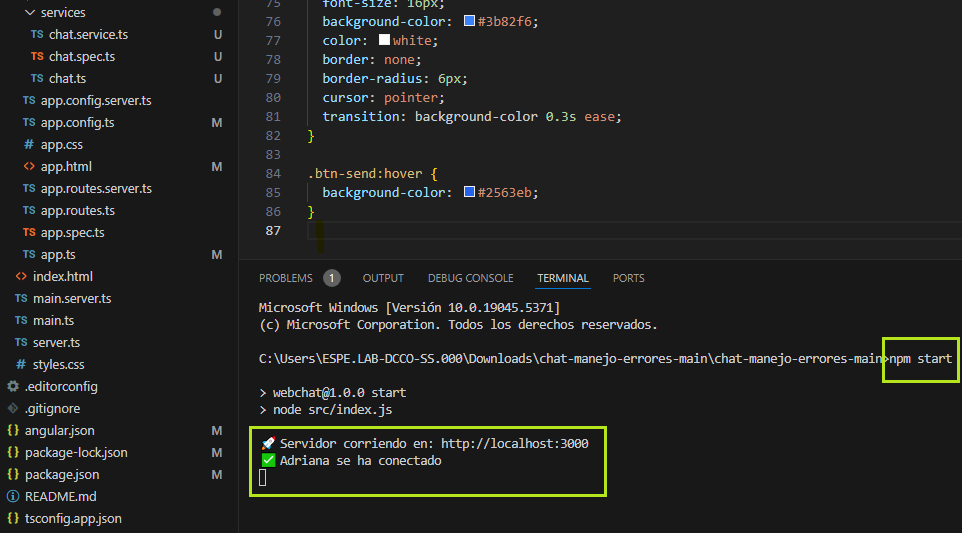
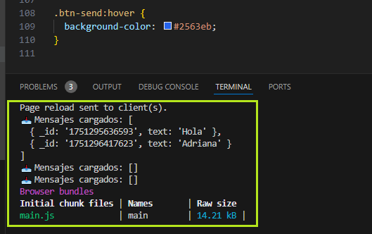
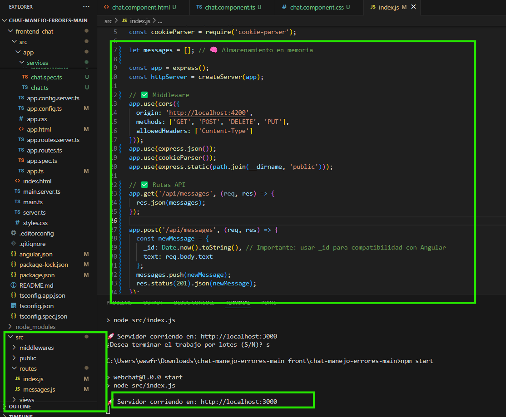
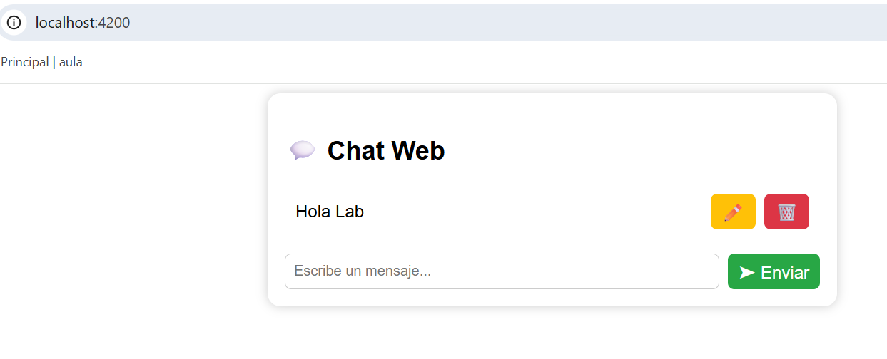
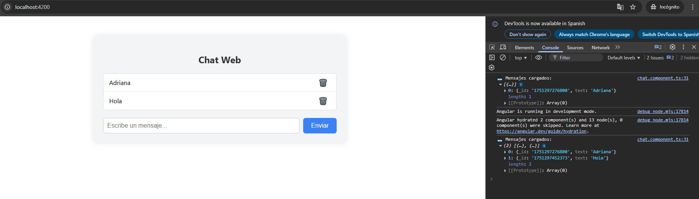
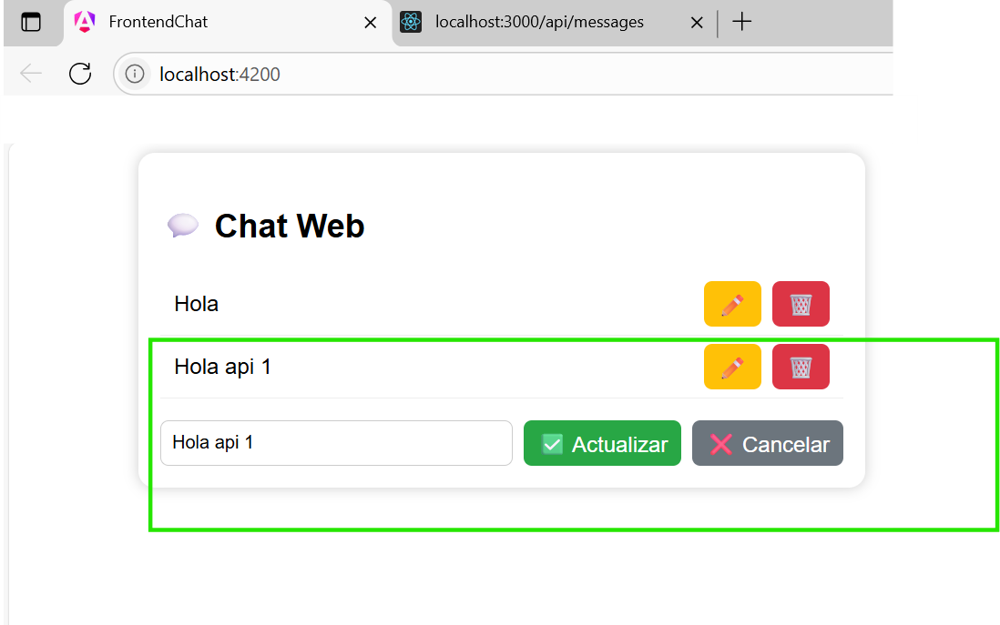
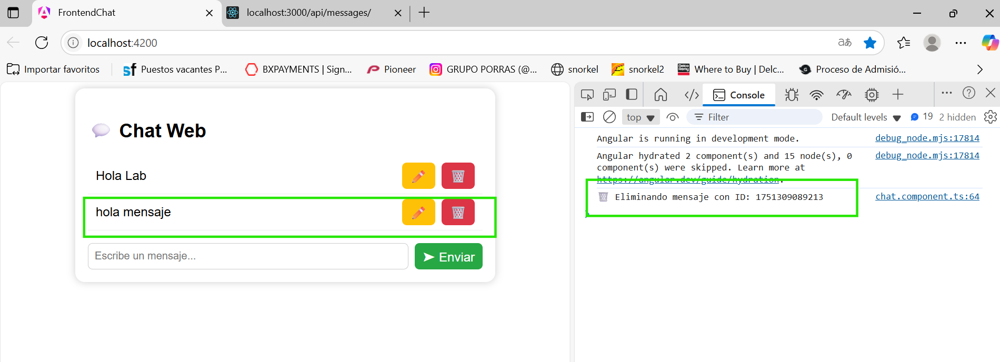
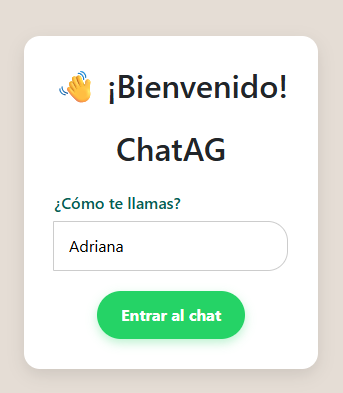

# 🧪 Práctica 2 - Consumo de una API RESTful desde una Aplicación Frontend

**DEPARTAMENTO:** Ciencias de la Computación  
**CARRERA:** Tecnologías de la Información  
**ASIGNATURA:** Aplicaciones Distribuidas  
**NIVEL:** 7°  
**DOCENTE:** Ing. Paulo Galarza, Mgs.  
**PRÁCTICA N°:** 2  
**TEMA DE LA PRÁCTICA:** Consumo de una API RESTful desde una Aplicación Frontend (Angular, Flutter, React o React Native)  
**ESTUDIANTE:** Adriana Pamela González Orellana  
**PERÍODO:** 202550  
**FECHA:** Junio 2025  

---

## 📄 RESUMEN

Esta práctica tuvo como objetivo implementar un sistema de chat web utilizando Angular como framework frontend y Node.js con Express como backend. Se consumió una API RESTful creada manualmente que permite realizar operaciones CRUD (crear, leer, actualizar, eliminar) sobre los mensajes. Se integró Socket.IO para facilitar la actualización en tiempo real del chat. A lo largo del proceso se construyó un frontend dinámico con Angular, se probaron los endpoints con herramientas como Postman y se validó la comunicación bidireccional con el backend. El sistema ofrece una interfaz visual amigable y funcional. Esta actividad fortalece el entendimiento de la arquitectura cliente-servidor y el consumo de APIs RESTful desde una aplicación moderna.

**Palabras clave:** Angular, API RESTful, Socket.IO

---

## 1. INTRODUCCIÓN

En este laboratorio se buscó aplicar los conocimientos sobre APIs RESTful y su consumo desde una aplicación frontend desarrollada en Angular. Se construyó un sistema de chat funcional, integrando servicios HTTP para consumir endpoints del backend y Socket.IO para actualizar la interfaz en tiempo real. Esta actividad también refuerza el uso de buenas prácticas de desarrollo, organización modular del código y comunicación entre componentes en Angular.

---

## 2. OBJETIVO(S)

**2.1 Objetivo General:**  
Consumir una API RESTful propia desde una aplicación frontend.

**2.2 Objetivos Específicos:**  
- Mostrar los datos obtenidos de la API mediante Angular.  
- Implementar operaciones CRUD sobre los mensajes.  
- Documentar el proceso en un informe técnico con evidencia visual.

---

## 3. MARCO TEÓRICO

Una API RESTful (Representational State Transfer) permite la comunicación entre sistemas utilizando el protocolo HTTP y operaciones CRUD. Angular, por su parte, es un framework frontend que facilita la construcción de aplicaciones reactivas mediante componentes y servicios. Socket.IO permite la transmisión en tiempo real entre el cliente y el servidor. Estas tecnologías combinadas permiten una experiencia de usuario fluida y dinámica.

---

## 4. DESCRIPCIÓN DEL PROCEDIMIENTO

- Se configuró el entorno de Angular con `ng new` y se generó un servicio para el consumo de la API (`ChatService`).  
- Se definieron los endpoints del backend (`/api/messages`) usando Node.js y Express.  
- Se implementó la funcionalidad en Angular para listar, crear, editar y eliminar mensajes.  
- Se utilizó Socket.IO para emitir y recibir mensajes en tiempo real.  
- Se probaron las rutas con Postman y se documentó el proceso.

**Captura - Configuración del API:**  

**Captura - Código Backend:**  

**Captura - Vista del frontend en Angular:**  

**Captura - index API:**  

---

## 5. ANÁLISIS DE RESULTADOS

Se validó que el frontend puede consumir correctamente la API:  
- Los mensajes se muestran al cargar la página.  
- Se permite enviar nuevos mensajes.  
- Se puede eliminar mensajes existentes.  
- Al editar un mensaje, este se actualiza correctamente.  
- La interfaz es intuitiva y con buena experiencia de usuario.

**Captura - Chat general:**  

**Captura - Envío de mensaje:**  

**Captura - Edición de mensaje:**  

**Captura - Eliminación de mensaje:**  

**Captura - Vista del registro:**  

---

## 6. GRÁFICOS O FOTOGRAFÍAS

Ver sección anterior con capturas de pantallas relevantes al desarrollo y pruebas.

---

## 7. DISCUSIÓN

Esta práctica permitió integrar todos los conocimientos previos sobre consumo de APIs RESTful y desarrollo con Angular. La correcta implementación de las rutas en Express, el diseño modular en Angular y el uso de servicios garantizó la funcionalidad esperada. Uno de los desafíos fue manejar correctamente la actualización del mensaje editado, que se resolvió con ajustes en el backend y en el componente de Angular.

---

## 8. CONCLUSIONES

- Se logró consumir exitosamente una API RESTful desde Angular.  
- La aplicación implementa todas las operaciones CRUD sobre los mensajes.  
- El uso de servicios y componentes en Angular facilita la escalabilidad y mantenimiento del código.

---

## 9. BIBLIOGRAFÍA

- Angular Docs. (2024). [https://angular.io](https://angular.io)  
- Node.js Docs. (2024). [https://nodejs.org](https://nodejs.org)  
- Socket.IO Docs. (2024). [https://socket.io](https://socket.io)  
- Express Docs. (2024). [https://expressjs.com](https://expressjs.com)